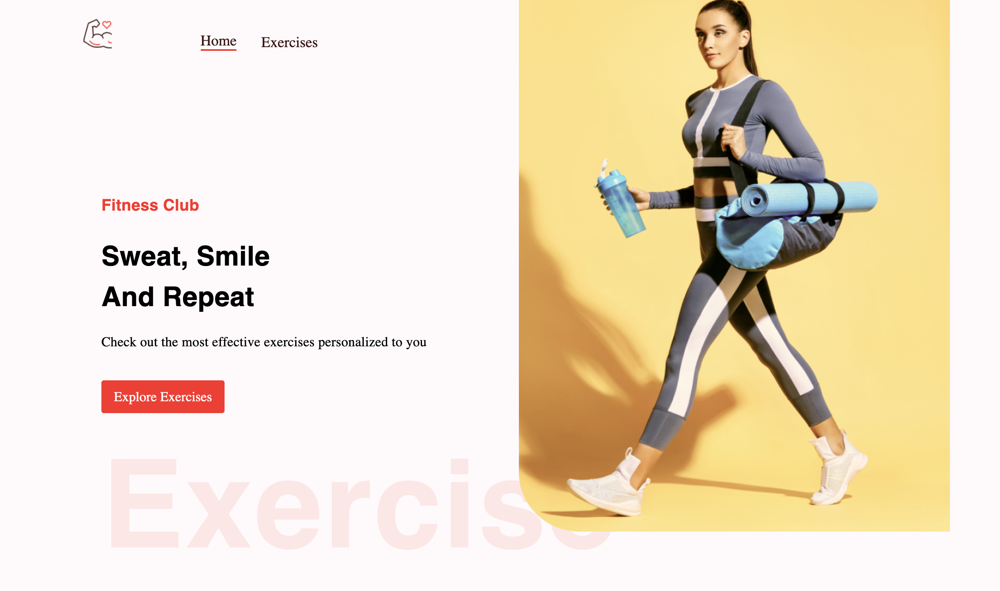
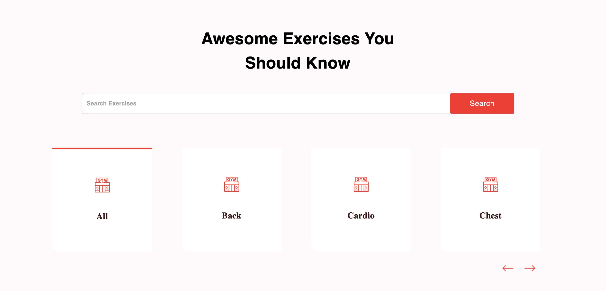
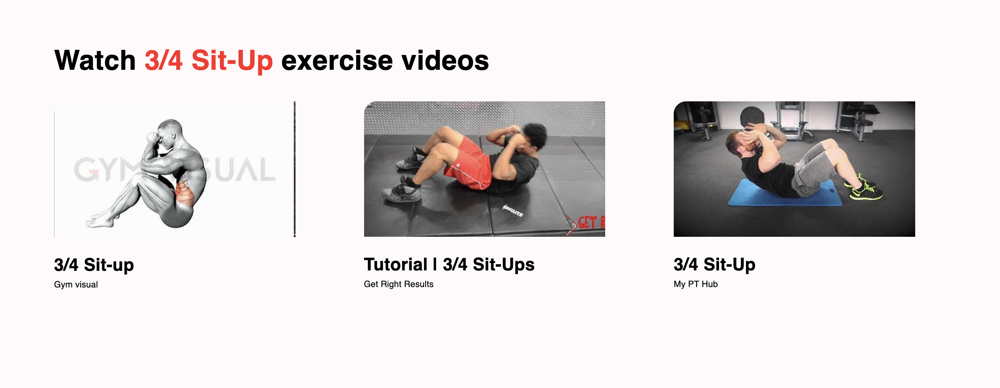
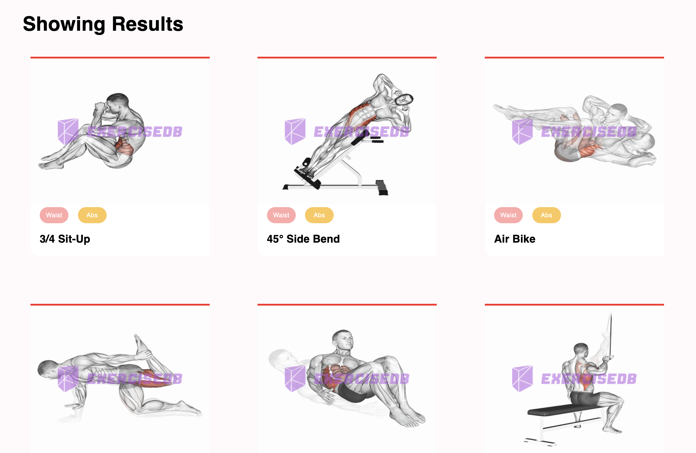
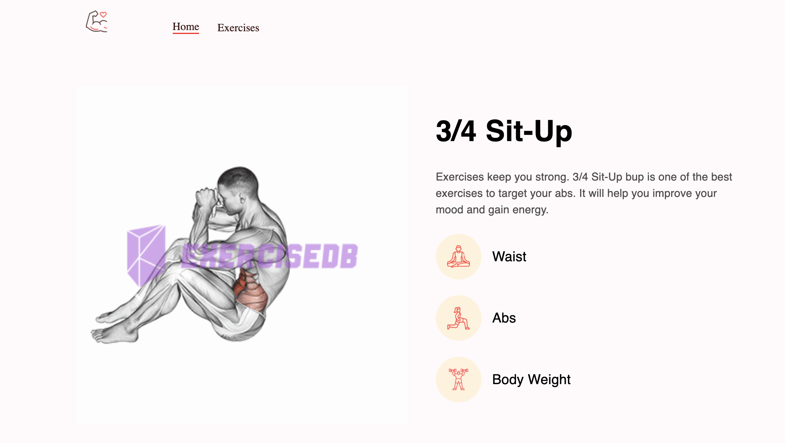

# React Fitness Application

This project is a comprehensive fitness app built with React, utilizing multiple APIs to fetch exercise details, GIFs, and related YouTube videos. Users can search exercises by muscle group, equipment, and target muscle.

## Features

- Search for exercises by muscle group, equipment, and target muscle
- View exercise details including animated GIFs
- Access related YouTube videos for exercise tutorials
- User-friendly interface with responsive design

## APIs Used

- **ExerciseDB API (via RapidAPI):** Provides exercise details, including GIFs.
- **YouTube Data API (via RapidAPI):** Fetches related YouTube videos.

## Installation

1. Clone the repository:
   git clone https://github.com/steven-serruya/gym_exercises.git

2. Navigate to the project directory:
   cd gym_exercises

3. Install dependencies:
    npm install

4. Create a .env file in the root directory and add your API keys:
    REACT_APP_RAPIDAPI_KEY=your_rapidapi_key

5. Run the app:
    npm start

## Screenshots

## Inspiration
This project was inspired by the tutorial provided by JavaScript Mastery.

Made with ❤️ by Steven Serruya under the guidance of JavaScript Mastery.

